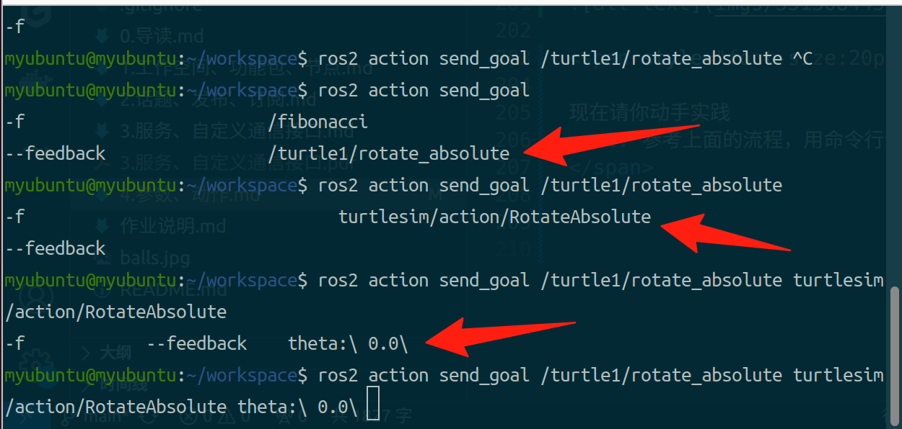
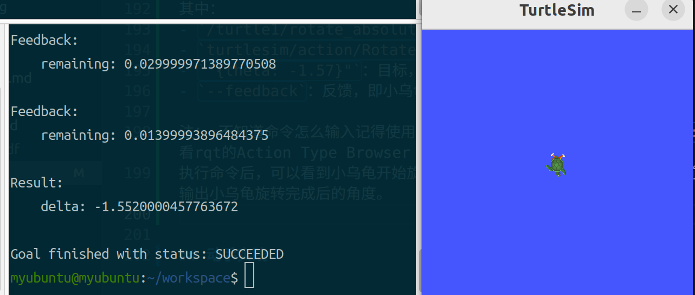

# 参数通信是什么？
## 参数定义
ROS2官方对参数的定义是：

参数是节点的一个配置值，你可以认为参数是**一个节点的配置**

ROS2参数是由**键值对**组成的。键值对指的是名字和数值，例如：

- 名字：李四写小说周期，值：5s
- 名字：显示器亮度，值：60%

名字的数据类型通常是字符串，而值的数据类型则根据具体的应用场景而变化。在ROS2中，支持的参数值的类型包括：

- `bool` 和 `bool[]`：布尔类型，用于表示开关状态，如控制雷达节点的启动与停止扫描。
- `int64` 和 `int64[]`：整型，用于表示数字，例如设定李四节点写小说的周期值。
- `float64` 和 `float64[]`：浮点型，用于表示带有小数部分的数值。
- `string` 和 `string[]`：字符串，可用于存储文字信息，如雷达控制节点中实际雷达设备的IP地址。
- `byte[]`：字节数组，适合存储图像或点云数据等二进制信息。

## 体验参数
启动两个终端，分别运行小海龟仿真器和键盘控制节点：
```bash
ros2 run turtlesim turtlesim_node
ros2 run turtlesim turtle_teleop_key
```

打开一个新的终端，打开rqt，找到Plugins-Dynamic Reconfigure，点击打开：


这里我们可以看到有turtlesim这个节点。
点击后可以看到有好些，参数，比如background_r、background_g、background_b等。
turtlesim将小乌龟的背景颜色写作了参数，我们可以在rqt中动态修改这些参数，从而修改背景颜色。
这是默认情况下的背景颜色：

这是修改r和b为0，g为255的背景颜色：


## 参数实现-Python

在src下，新建ROS功能包：
```bash
ros2 pkg create example_parameter --node-name  example_parameter_node --dependencies rclpy --build-type ament_python
```
在`example_parameter_node.py`中输入如下代码：
```python


import rclpy                                     # ROS2 Python接口库
from rclpy.node   import Node
import rclpy.parameter                    # ROS2 节点类
from rcl_interfaces.msg import SetParametersResult
class ExampleParameter(Node):
    def __init__(self, name):
        super().__init__(name)                                    # ROS2节点父类初始化
        self.timer = self.create_timer(5, self.timer_callback)    # 创建一个定时器（单位为秒的周期，定时执行的回调函数）
        self.declare_parameter('publish_speed',5)              # 创建一个参数，并设置参数的默认值
        self.add_on_set_parameters_callback(self.parameters_callback)#添加参数设置回调函数
        
        
    def parameters_callback(self, params)->SetParametersResult:#参数设置回调函数
        result = SetParametersResult(successful=True)#创建参数设置结果对象
        for param in params:
            if param.name == 'publish_speed':
                if param.value <0 or param.value >10:
                    result.successful = False
                    result.reason = '速度不在0-10之间'
                    self.get_logger().info(f'速度不在0-10之间,参数设置失败')
                    break
                # 参数设置成功，可以在这里添加额外的逻辑
                self.get_logger().info(f'param {param.name} set to {param.value}')
                self.timer.cancel()#取消之前的定时器
                self.timer = self.create_timer(param.value, self.timer_callback)#更改定时器的周期
        return result
    def timer_callback(self):                                      # 创建定时器周期执行的回调函数
        speed = self.get_parameter('publish_speed').get_parameter_value().integer_value   # 从ROS2系统中读取参数的值,值类型为整数
        self.get_logger().info('现在的发布速度是: %d' % speed)     # 输出日志信息，打印读取到的参数值

def main(args=None):                                 # ROS2节点主入口main函数
    rclpy.init(args=args)                            # ROS2 Python接口初始化
    node = ExampleParameter("my_param")            # 创建ROS2节点对象并进行初始化
    rclpy.spin(node)                                 # 循环等待ROS2退出
    node.destroy_node()                              # 销毁节点对象
    rclpy.shutdown()                                 # 关闭ROS2 Python接口
if __name__=="__main__":
    main()
```
这里单独把这个命令拎出来讲讲
```python
speed = self.get_parameter('publish_speed').get_parameter_value().integer_value
```
这是获取参数值的方法，返回一个ParameterValue对象。ROS会根据你声明时的类型变量，确定该参数的类型

比如你用
`self.declare_parameter('publish_speed',5.5)`
声明参数，那么就应该从double_value获取参数值；
用
`self.declare_parameter('publish_speed',5)`
声明参数，那么就应该从integer_value获取参数值。

最后编译，运行:
```bash
colcon build --packages-select example_parameter
source install/setup.bash
ros2 run example_parameter example_parameter_node
```


默认的发布速度是5，每隔5秒输出一次。现在我们尝试使用rqt修改发布速度：
rqt-plugin-Configuration-dynamic reconfigure

找到对应的节点，并修改publish_speed参数值。


<span style="font-size:20px; color:blue;">

现在请你动手实践
   1. 打开example_workspace中的功能包example_parameter，找到代码源文件，替换用注释块包围起来的内容，使其可以正常运行（或者直接参照上面的教程自己创建一个功能包，使其可以正常运行）
   2. 使用rqt，或者命令行对参数进行调用测试

</span>  


## 动作
### 为什么要使用动作？服务不够吗？
举个例子，比如我们想让机器人转个圈，这肯定不是一下就可以完成的，机器人得一点一点旋转，直到360度才能结束，假设机器人并不在我们眼前，发出指令后，我们根本不知道机器人到底有没有开始转圈，转到哪里了？

OK，现在我们需要的是一个**反馈**，比如每隔1s，告诉我们当前转到多少度了，10度、20度、30度，一段时间之后，到了360度，**再发送一个信息，表示动作执行完成。**

这样一个需要执行一段时间的行为，使用动作的通信机制就更为合适，就像装了一个进度条，我们可以随时把控进度，如果运动过程当中，我们还可以随时发送一个**取消运动的命令。**
### Action的组成部分
知道了Action的出现原因，接着说说Action的三大组成部分目标、反馈和结果。

**目标**：即Action客户端告诉服务端要做什么，服务端针对该目标要有响应。解决了不能确认服务端接收并处理目标问题
**反馈**：即Action服务端告诉客户端此时做的进度如何（类似与工作汇报）。解决执行过程中没有反馈问题
**结果**：即Action服务端最终告诉客户端其执行结果，结果最后返回，用于表示任务最终执行情况。


## 感受Action
1. 启动乌龟模拟器和键盘控制节点
```
ros2 run turtlesim turtlesim_node
```
2. 键盘控制节点
```
ros2 run turtlesim turtle_teleop_key
```

打开键盘控制节点后，你应该窗口中可以看到下面的提示

Use arrow keys to move the turtle.
Use G|B|V|C|D|E|R|T keys to rotate to absolute orientations. 'F'

这段提示什么意思呢？其实就是字面的意思，

- 小乌龟键盘控制节点，提供两种可选的控制方式。

- 方向键，通过话题(Topic)控制小乌龟的（直接发送移动话题）
绝对旋转，则是采用动作(Action)来控制的小乌龟

3. 使用绝对旋转(Action)控制小乌龟
使用绝对旋转控制小乌龟即使用Action来控制小乌龟。

在小乌龟的遥控窗口我们使用键盘上的**F按键周围的按键**,来尝试运行控制下小乌龟的方向，你会看到小乌龟根据我们所按下按键所在的方向来在原地进行旋转。

同时在旋转的过程中，我们可以使用F按键，来取消小乌龟的运动。
## 命令行使用Action小乌龟绝对旋转
在终端中运行
```bash
ros2 action list
```
可以看到一个Action:`/turtle1/rotate_absolute`
刚才使用键盘控制小乌龟，就是通过调用这个Action来实现的。
为了调用这个Action，我们要先看看这个Action长什么样
在rqt-Plugins-Action-Action Type Browser中，找到Turtlesim，选择`/turtle1/rotate_absolute`，可以看到如下内容：

其中：
- goal：目标，即我们想要小乌龟旋转到哪个角度，是需要**发送给Action的**
- feedback：反馈，即小乌龟旋转过程中的角度，Action会**每隔一段时间**返回一次
- result：结果，即小乌龟旋转完成后的角度，是Action**最终**返回的

下面我们尝试用命令行调用这个Action
输入`ros2 action send_goal --help`，查看send_goal命令的用法

想要让小乌龟旋转一定角度，我们要给他传入一个theta（目标），命令如下：
`ros2 action send_goal /turtle1/rotate_absolute turtlesim/action/RotateAbsolute "{theta: -1.57}" --feedback`
或者：
`ros2 action send_goal /turtle1/rotate_absolute turtlesim/action/RotateAbsolute theta:\ 1.57\`
两者效果一样
其中：
- `/turtle1/rotate_absolute`：Action的名称
- `turtlesim/action/RotateAbsolute`：Action的类型
- `"{theta: -1.57}"或theta:\ 1.57\`：目标，即小乌龟旋转到多少角度。-1.57弧度为-pi/2，即-90度（x轴正半轴为0度，逆时针旋转为正）
- `--feedback`：反馈，即小乌龟旋转过程中的角度

注： 不知道命令怎么输入记得使用Tab键补全，每一步都能看到提示

执行命令后，可以看到小乌龟开始旋转，每隔一定时间，终端会输出一次小乌龟当前的角度，最后输出小乌龟旋转完成后的角度。


<span style="font-size:20px; color:blue;">

现在请你动手实践
   1. 参考上面的流程，用命令行调用Action，让小乌龟旋转到**90度**

</span>  


## Action的Python实现
我们现在来写一个节点，实现计算斐波那契数列。
### 目标：
- 输入一个数字order，计算斐波那契数列的第order项
- 计算过程中，每隔1s输出一次当前计算进度，即第i项的值
- 计算完成后，输出计算结果，即第order项的值
例如：
- 输入order=8
- feedback：
[0,1,1]
[0,1,1,2]
....
[0,1,1,2,3,5,8,13]
[0,1,1,2,3,5,8,13,21]
- result：[0,1,1,2,3,5,8,13,21]，即斐波那契数列的第8项为21

### 代码实现：
1. 创建一个功能包`example_action_server`，并创建一个节点`example_action_server_node`
```bash
ros2 pkg create example_action_server --node-name example_action_server_node --build-type ament_python --dependencies rclpy example_interfaces
```
为什么要有example_interfaces这个依赖呢？

因为ROS为我们提供了一个学习用的接口Fibonacci，这个接口定义了Action的三个组成部分目标、反馈和结果，我们直接使用这个接口，就不用自己写接口了。
从rqt中可以看到这个接口长什么样子：
```
int32 order
---
sequence<int32> sequence
---
sequence<int32> sequence
```
2. 编辑example_action_server_node.py
```python

import time
from example_interfaces.action import Fibonacci
import rclpy
from rclpy.action import ActionServer, CancelResponse, GoalResponse
import rclpy.action
from rclpy.node import Node


class ExampleActionServer(Node):

    def __init__(self):
        super().__init__('example_action_server')

        self._action_server = ActionServer(## 初始化一个ActionServer
            self,
            Fibonacci,
            'fibonacci',
            execute_callback=self.execute_callback,
            goal_callback=self.goal_callback,
            cancel_callback=self.cancel_callback)

    def goal_callback(self, goal_request):## 当客户端请求时，会调用这个函数
        """Accept or reject a client request to begin an action."""
        self.get_logger().info('Received goal request')## 可以在这里决定是否接受客户端的请求
        return GoalResponse.ACCEPT

    def cancel_callback(self, goal_handle):## 当客户端请求取消时，会调用这个函数
        """Accept or reject a client request to cancel an action."""
        self.get_logger().info('Received cancel request')## 可以在这里决定是否取消客户端的请求
        return CancelResponse.ACCEPT

    def execute_callback(self, goal_handle:rclpy.action.server.ServerGoalHandle):##执行目标
        """Execute a goal."""
        self.get_logger().info('Executing goal...')## 执行目标

        # Append the seeds for the Fibonacci sequence
        feedback_msg = Fibonacci.Feedback()## 初始化Feedback对象
        feedback_msg.sequence = [0, 1]## 初始化Fibonacci序列

        # Start executing the action
        for i in range(1, goal_handle.request.order):
            if goal_handle.is_cancel_requested:## 如果客户端请求取消，则取消目标
                goal_handle.canceled()
                self.get_logger().info('Goal canceled')
                return Fibonacci.Result()

            # Update Fibonacci sequence
            feedback_msg.sequence.append(feedback_msg.sequence[i] + feedback_msg.sequence[i-1])

            self.get_logger().info('Publishing feedback: {0}'.format(feedback_msg.sequence))

            # Publish the feedback
            goal_handle.publish_feedback(feedback_msg)

            # Sleep for demonstration purposes
            time.sleep(1)

        goal_handle.succeed()

        # Populate result message
        result = Fibonacci.Result()
        result.sequence = feedback_msg.sequence

        self.get_logger().info('Returning result: {0}'.format(result.sequence))

        return result


def main(args=None):
    rclpy.init(args=args)
    example_action_server = ExampleActionServer()
    rclpy.spin(example_action_server)

if __name__ == '__main__':
    main()

```
3. 编译
```
colcon build --packages-select example_action_server
source install/setup.bash
```
4. 运行
```
ros2 run example_action_server example_action_server_node
```

可以看到并没有输出，但是server已经运行起来了。
5. 调用Action测试
新建一个终端，运行
```
ros2 action send_goal /fibonacci example_interfaces/action/Fibonacci order:\ 10\
```
结果如图


<span style="font-size:20px; color:blue;">

现在请你动手实践
   1. 打开example_workspace中的功能包example_action_server，找到代码源文件，替换用注释块包围起来的内容，使其可以正常运行
   2. （或者直接参照上面的教程自己创建一个功能包，Copy代码使其可以正常运行）
   3. 使用命令行对Action进行调用测试

</span>  


## 后记
现在我们看似已经跑通Action的整个流程了，但是还有一个功能并没能实现，那就是**取消Action**。  
理论上cancel也只是一个服务，只需要发送一个取消的Request就可以实现
然而经过我的尝试，发现**无论是rqt还是命令行调用，都无法直接取消Action**，可能只有编写一个Action Client才能实现这个功能，而这又涉及到新的知识点了。
为了减轻大家的负担，这里Action Client我们先按下不提，感兴趣的同学可以跟着[这个链接](https://book.guyuehome.com/ROS2/2.%E6%A0%B8%E5%BF%83%E6%A6%82%E5%BF%B5/2.7_%E5%8A%A8%E4%BD%9C/#_7)
或者[这个链接](https://fishros.com/d2lros2/#/humble/chapt4/get_started/4.%E5%8A%A8%E4%BD%9C%EF%BC%88Action%EF%BC%89%E9%80%9A%E4%BF%A1%E4%B8%8E%E8%87%AA%E5%AE%9A%E4%B9%89%E6%8E%A5%E5%8F%A3)自己进行学习。
